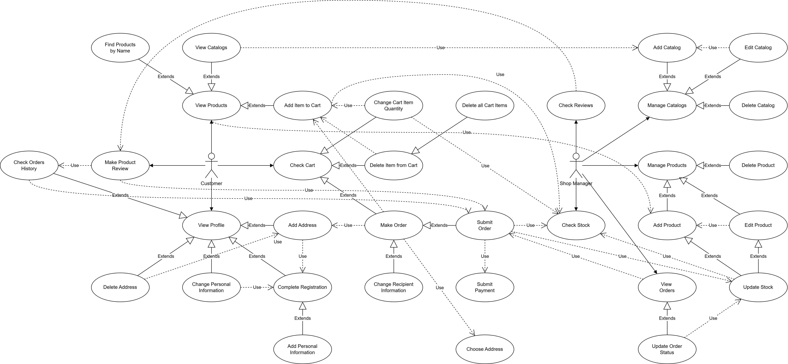

# **Sweet Shop - Lab2 - Use Cases**

---
## PLANTUML Declaration
```plantuml
@startuml
!include Use_Case.puml
@enduml
```
## **Requirements**
**1. Customer must be able to register and manage their profile**
**2. Customer must be able to browse and search products**
**3. Customer must be able to manage shopping cart**
**4. Customer must be able to make and pay for orders, make reviews**
**5. Administrator must be able to manage products, catalogs and stock**
**6. Administrator must be able to view and update customer orders, view customer reviews**
## **Requirements Traceability Matrix**
| Use Case ↓ / Requirement →   | R1 | R2 | R3 | R4 | R5 | R6 |
|------------------------------|----|----|----|----|----|----|
| Add Address                  | ✅ |    |    |    |    |    |
| Add Catalog                  |   |    |    |    | ✅ |    |
| Add Item to Cart             |   |    | ✅ |    |    |    |
| Add Personal Information     | ✅ |    |    |    |    |    |
| Add Product                  |   |    |    |    | ✅ |    |
| Change Cart Item Quantity    |   |    | ✅ |    |    |    |
| Change Personal Information  | ✅ |    |    |    |    |    |
| Change Recipient Information |   |    |    | ✅ |    |    |
| Check Cart                   |   |    | ✅ |    |    |    |
| Change Personal Information  | ✅ |    |    |    |    |    |
| Check Orders History         | ✅ |    |    |    |    |    |
| Check Reviews                |   |    |    |    |    | ✅ |
| Check Stock                  |   |    |    | ✅ | ✅ |    |
| Choose Address               | ✅ |    |    | ✅ |    |    |
| Complete Registration        | ✅ |    |    |    |    |    |
| Delete Address               | ✅ |    |    |    |    |    |
| Delete All Cart Items        |   |    | ✅ |    |    |    |
| Delete Catalog               |   |    |    |    | ✅ |    |
| Delete Item from Cart        |   |    | ✅ |    |    |    |
| Delete Product               |   |    |    |    | ✅ |    |
| Edit Catalog                 |   |    |    |    | ✅ |    |
| Edit Product                 |   |    |    |    | ✅ |    |
| Find Products by Name        |   | ✅ |    |    |    |    |
| Make Order                   |   |    |    | ✅ |    |    |
| Make Product Review          |   |    |    | ✅ |    |    |
| Manage Catalogs              |   |    |    |    | ✅ |    |
| Manage Products              |   |    |    |    | ✅ |    |
| Submit Order                 |   |    |    | ✅ |    | ✅ |
| Submit Payment               |   |    |    | ✅ |    |    |
| Update Order Status          |   |    |    |    |    | ✅ |
| Update Stock                 |   |    |    | ✅ | ✅ |    |
| View Catalogs                |   |    | ✅ |    |    |    |
| View Orders                  |   |    |    |    |    | ✅ |
| View Products                |   | ✅ |    |    |    |    |
| View Profile                 | ✅ |    |    |    |    |    |


