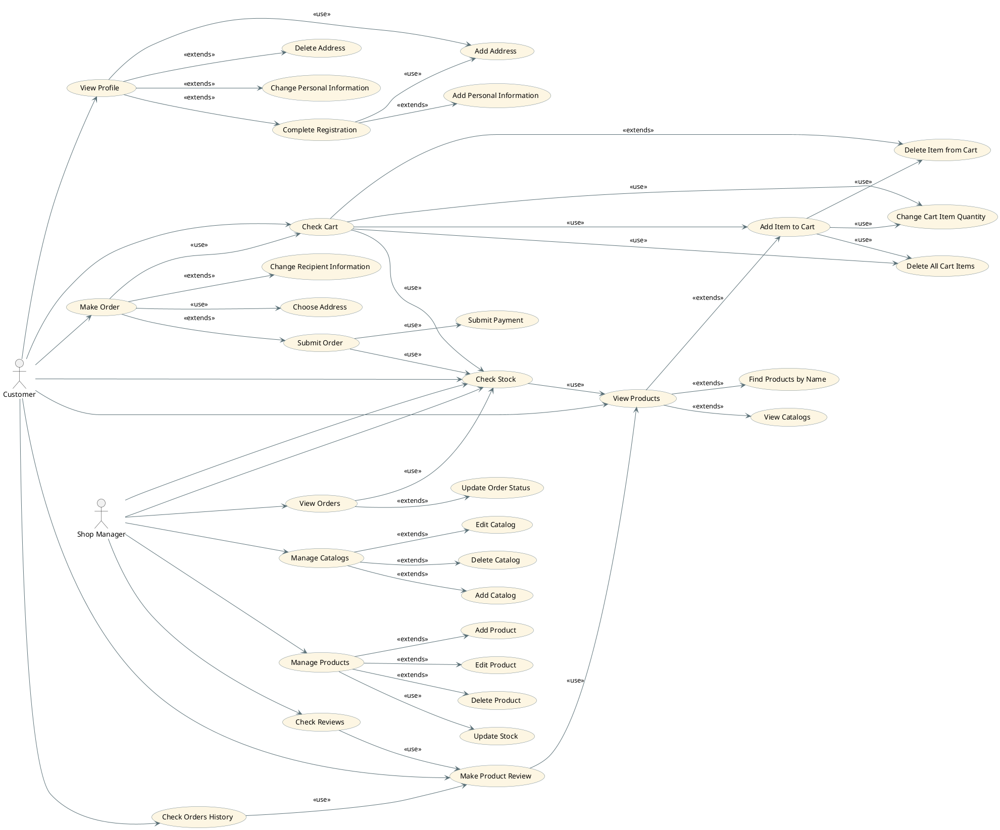

# **Sweet Shop - Lab2 - Use Cases**

---
# **Functional and Non-Functional Requirements**
## **Detailed Functional Requirements**
### 1. **Customer Management**

1.1 **The system shall allow customers to register with personal information (name, email, password).**

1.2 **The system shall allow customers to log in and log out securely.**

1.3 **The system shall allow customers to edit and update their personal information.**

1.4 **The system shall allow customers to add, view, and delete delivery addresses.**

1.5 **The system shall allow customers to view their order history.**

1.6 **The system shall allow customers to manage their profile information.**

### 2. **Product Browsing and Search**

2.1 **The system shall allow customers to browse available products by category or catalog.**

2.2 **The system shall allow customers to search for products by name.**

2.3 **The system shall display detailed product information (name, description, price, image, stock availability).**

2.4 **The system shall allow customers to view reviews and ratings for each product.**

### 3. **Shopping Cart Management**

3.1 **The system shall allow customers to add products to the shopping cart.**

3.2 **The system shall allow customers to remove items from the shopping cart.**

3.3 **The system shall allow customers to change the quantity of items in the cart.**

3.4 **The system shall allow customers to view all items currently in the cart.**

3.5 **The system shall allow customers to clear the entire cart.**

### 4. **Order and Payment Management**

4.1 **The system shall allow customers to create (submit) an order based on the items in their cart.**

4.2 **The system shall allow customers to select a delivery address for an order.**

4.3 **The system shall allow customers to view their past and current orders.**

4.4 **The system shall allow customers to make payments securely for placed orders.**

4.5 **The system shall update the order status after successful payment.**

4.6 **The system shall allow customers to leave reviews and ratings for purchased products.**

### 5. **Administrator Management**

5.1 **The system shall allow the administrator to add, edit, and delete products.**

5.2 **The system shall allow the administrator to create, edit, and delete catalogs.**

5.3 **The system shall allow the administrator to view all customer orders.**

5.4 **The system shall allow the administrator to update the status of customer orders.**

5.5 **The system shall allow the administrator to manage stock levels (add or reduce product quantities).**

5.6 **The system shall allow the administrator to view customer reviews and feedback.**

---
## **Non-Functional Requirements**
### 1. **Performance Requirements**

1.1 **The system shall load the homepage within 3 seconds under normal network conditions.**

1.2 **The system shall handle at least 100 concurrent users without performance degradation.**

1.3 **Database queries shall return results within 2 seconds for standard operations (search, filter, browse).**

### 2. **Reliability and Availability**

2.1 **The system shall be available 95% of the time, excluding scheduled maintenance.**

2.2 **The system shall ensure that no data is lost during unexpected power or network failures.**

2.3 **The system shall automatically back up customer and order data daily.**

### 3. **Security Requirements**

3.1 **All passwords shall be stored in encrypted form.**

3.2 **The system shall use HTTPS to protect data transmission.**

3.3 **The system shall implement role-based access control (Customer, Administrator).**

3.4 **Payment transactions shall comply with PCI DSS standards or use a secure third-party payment gateway.**

3.5 **The system shall automatically log out inactive users after a predefined timeout period.**

### 4. **Usability Requirements**

4.1 **The user interface shall be intuitive and visually consistent across all pages.**

4.2 **The website shall provide navigation menus for easy access to products and features.**

4.3 **The system shall provide meaningful error messages and confirmations for user actions.**

4.4 **The system shall support responsive design for mobile and desktop devices.**

### 5. **Maintainability**

5.1 **The codebase shall follow modular and documented architecture to simplify maintenance.**

5.2 **The system shall allow easy updating of product catalogs and price lists by administrators.**

5.3 **System logs shall record critical events (logins, payments, order updates).**

### 6. **Scalability**

6.1 **The system shall support the addition of new product categories and payment methods without redesign.**

6.2 **The system shall handle increased data volume as the number of users and products grows.**

### 7. **Compatibility**

7.1 **The system shall run correctly on all major browsers (Chrome, Firefox, Edge, Safari).**

7.2 **The system shall be compatible with Windows, macOS, and mobile operating systems.**

---
# PLANTUML Declaration

## **Requirements**
1. **Customer must be able to register and manage their profile**
2. **Customer must be able to browse and search products**
3. **Customer must be able to manage shopping cart**
4. **Customer must be able to make and pay for orders, make reviews**
5. **Administrator must be able to manage products, catalogs and stock**
6. **Administrator must be able to view and update customer orders, view customer reviews**
---
# **Requirements Traceability Matrix**
| Use Case ↓ / Requirement →   | R1 | R2 | R3 | R4 | R5 | R6 |
|------------------------------|----|----|----|----|----|----|
| Add Address                  | ✅ |    |    |    |    |    |
| Add Catalog                  |   |    |    |    | ✅ |    |
| Add Item to Cart             |   |    | ✅ |    |    |    |
| Add Personal Information     | ✅ |    |    |    |    |    |
| Add Product                  |   |    |    |    | ✅ |    |
| Change Cart Item Quantity    |   |    | ✅ |    |    |    |
| Change Personal Information  | ✅ |    |    |    |    |    |
| Change Recipient Information |   |    |    | ✅ |    |    |
| Check Cart                   |   |    | ✅ |    |    |    |
| Change Personal Information  | ✅ |    |    |    |    |    |
| Check Orders History         | ✅ |    |    |    |    |    |
| Check Reviews                |   |    |    |    |    | ✅ |
| Check Stock                  |   |    |    | ✅ | ✅ |    |
| Choose Address               | ✅ |    |    | ✅ |    |    |
| Complete Registration        | ✅ |    |    |    |    |    |
| Delete Address               | ✅ |    |    |    |    |    |
| Delete All Cart Items        |   |    | ✅ |    |    |    |
| Delete Catalog               |   |    |    |    | ✅ |    |
| Delete Item from Cart        |   |    | ✅ |    |    |    |
| Delete Product               |   |    |    |    | ✅ |    |
| Edit Catalog                 |   |    |    |    | ✅ |    |
| Edit Product                 |   |    |    |    | ✅ |    |
| Find Products by Name        |   | ✅ |    |    |    |    |
| Make Order                   |   |    |    | ✅ |    |    |
| Make Product Review          |   |    |    | ✅ |    |    |
| Manage Catalogs              |   |    |    |    | ✅ |    |
| Manage Products              |   |    |    |    | ✅ |    |
| Submit Order                 |   |    |    | ✅ |    | ✅ |
| Submit Payment               |   |    |    | ✅ |    |    |
| Update Order Status          |   |    |    |    |    | ✅ |
| Update Stock                 |   |    |    | ✅ | ✅ |    |
| View Catalogs                |   |    | ✅ |    |    |    |
| View Orders                  |   |    |    |    |    | ✅ |
| View Products                |   | ✅ |    |    |    |    |
| View Profile                 | ✅ |    |    |    |    |    |

---

