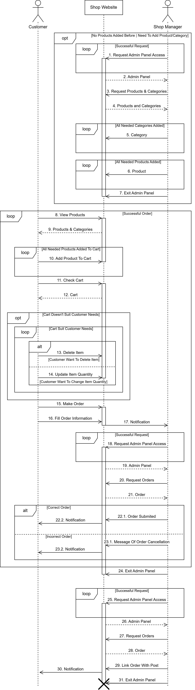
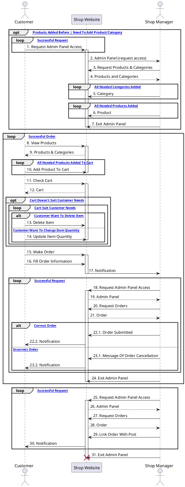

# **Creation and Confirmation of an Order**

# **PlantUML Declaration**

```plantuml
@startuml
actor Customer
participant "Shop Website" as ShopWebsite
actor "Shop Manager" as ShopManager

opt [No Products Added Before | Need To Add Product/Category]
  loop [- Successful Request]
    Customer -> ShopWebsite : 1. Request Admin Panel Access
    activate ShopWebsite
    end
    ShopWebsite -> ShopManager : 2. Admin Panel (request access)
    ShopManager -> ShopWebsite : 3. Request Products & Categories
    ShopWebsite --> ShopManager : 4. Products and Categories

    loop [- All Needed Categories Added]
      ShopManager -> ShopWebsite : 5. Category

    end

    loop [- All Needed Products Added]
      ShopManager -> ShopWebsite : 6. Product
    end

    ShopManager -> ShopWebsite : 7. Exit Admin Panel
    deactivate ShopWebsite
end

loop [- Successful Order]
  Customer -> ShopWebsite : 8. View Products
  activate ShopWebsite
  ShopWebsite --> Customer : 9. Products & Categories

  loop [- All Needed Products Added To Cart]
    Customer -> ShopWebsite : 10. Add Product To Cart
  deactivate ShopWebsite
  end

  Customer -> ShopWebsite : 11. Check Cart
  activate ShopWebsite
  ShopWebsite --> Customer : 12. Cart

  opt [- Cart Doesn't Suit Customer Needs]
    loop [- Cart Suit Customer Needs]
      alt [- Customer Want To Delete Item]
        Customer -> ShopWebsite : 13. Delete Item
      else [- Customer Want To Change Item Quantity]
        Customer -> ShopWebsite : 14. Update Item Quantity
      deactivate ShopWebsite
      end
    end
  end

  Customer -> ShopWebsite : 15. Make Order
  activate ShopWebsite
  Customer -> ShopWebsite : 16. Fill Order Information
  ShopWebsite -> ShopManager : 17. Notification
  deactivate ShopWebsite

  ' --- Manager processes the order ---
  loop [- Successful Request]
    ShopManager -> ShopWebsite : 18. Request Admin Panel Access
    activate ShopWebsite
    ShopWebsite --> ShopManager : 19. Admin Panel
    ShopManager -> ShopWebsite : 20. Request Orders
    ShopWebsite --> ShopManager : 21. Order

    alt [- Correct Order]
      ShopManager -> ShopWebsite : 22.1. Order Submitted
      ShopWebsite -> Customer : 22.2. Notification
    else [- Incorrect Order]
      ShopManager -> ShopWebsite : 23.1. Message Of Order Cancellation
      ShopWebsite -> Customer : 23.2. Notification
    end
  end
      ShopManager -> ShopWebsite : 24. Exit Admin Panel
      deactivate ShopWebsite
end

loop [- Successful Request]
  ShopManager -> ShopWebsite : 25. Request Admin Panel Access
  activate ShopWebsite
  ShopWebsite --> ShopManager : 26. Admin Panel

  ShopManager -> ShopWebsite : 27. Request Orders
  ShopWebsite --> ShopManager : 28. Order
  ShopManager -> ShopWebsite : 29. Link Order With Post
  ShopWebsite -> Customer : 30. Notification
end
  ShopManager -> ShopWebsite : 31. Exit Admin Panel

  deactivate ShopWebsite
  destroy ShopWebsite

@enduml
```

# **PlantUML Generated Image**

