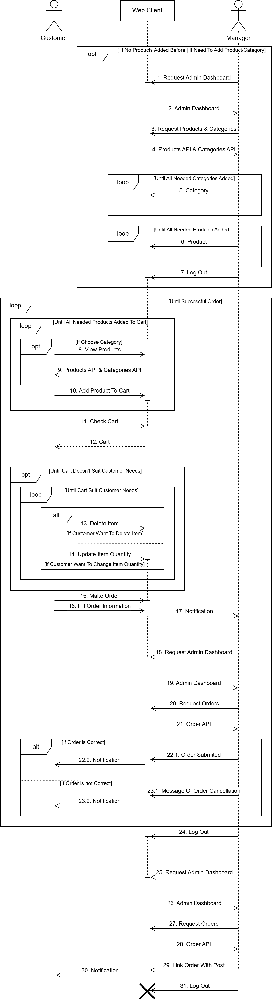
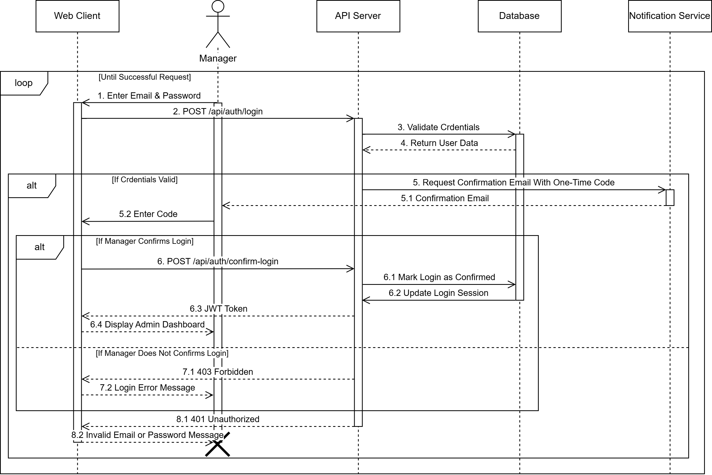
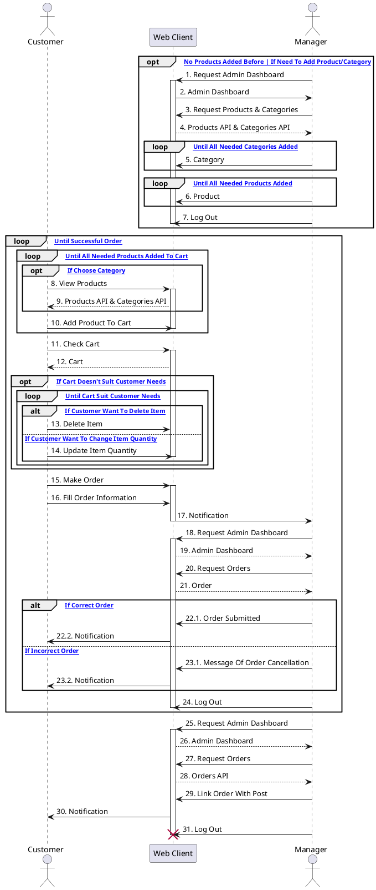
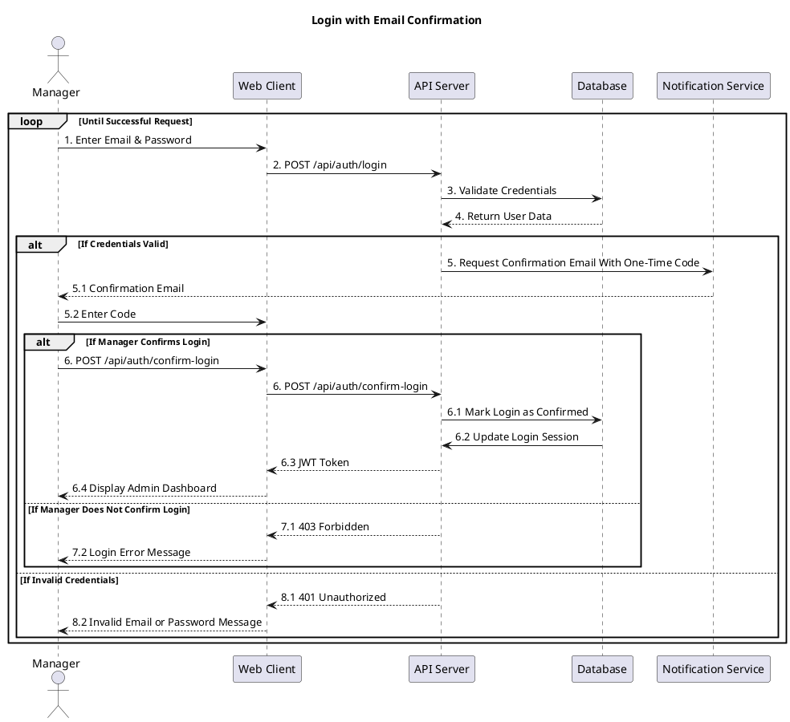
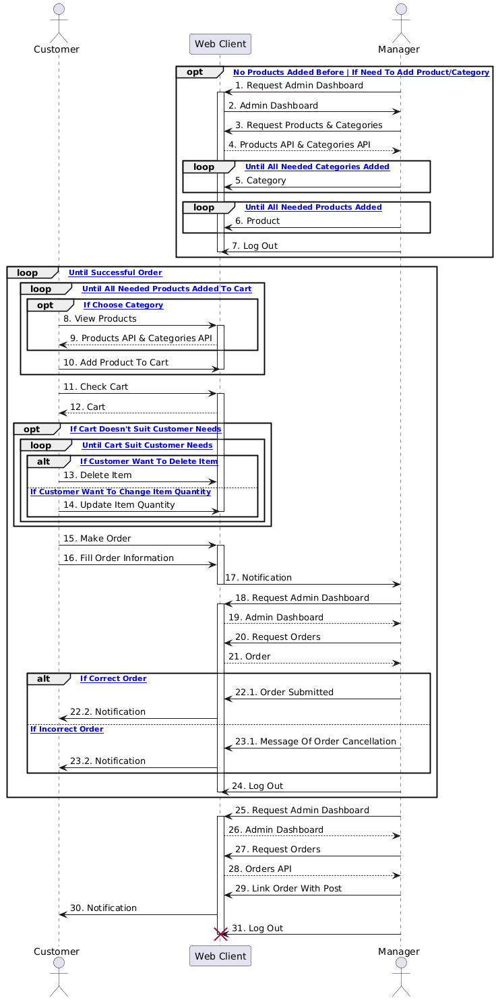
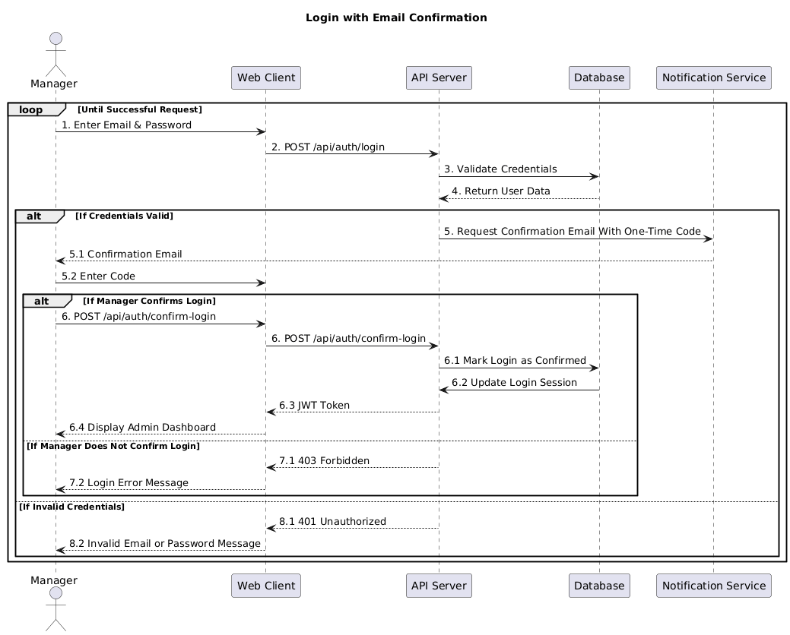

# **Creation and Confirmation of an Order**

# **Manager Authorization**

# **PlantUML Declaration**

```plantuml
@startuml
actor Customer
participant "Web Client" as ShopWebsite
actor "Manager" as ShopManager

opt [If No Products Added Before | If Need To Add Product/Category]
    ShopManager -> ShopWebsite : 1. Request Admin Dashboard
    activate ShopWebsite
    ShopWebsite -> ShopManager : 2. Admin Dashboard
    ShopManager -> ShopWebsite : 3. Request Products & Categories
    ShopWebsite --> ShopManager : 4. Products API & Categories API

    loop [- Until All Needed Categories Added]
      ShopManager -> ShopWebsite : 5. Category

    end

    loop [- Until All Needed Products Added]
      ShopManager -> ShopWebsite : 6. Product
    end

    ShopManager -> ShopWebsite : 7. Log Out
    deactivate ShopWebsite
end

loop [- Until Successful Order]
loop [- Until All Needed Products Added To Cart]
opt [- If Choose Category]
  Customer -> ShopWebsite : 8. View Products
  activate ShopWebsite
  ShopWebsite --> Customer : 9. Products API & Categories API
  end
    Customer -> ShopWebsite : 10. Add Product To Cart
  deactivate ShopWebsite
  end

  Customer -> ShopWebsite : 11. Check Cart
  activate ShopWebsite
  ShopWebsite --> Customer : 12. Cart

  opt [- If Cart Doesn't Suit Customer Needs]
    loop [- Until Cart Suit Customer Needs]
      alt [- If Customer Want To Delete Item]
        Customer -> ShopWebsite : 13. Delete Item
      else [- If Customer Want To Change Item Quantity]
        Customer -> ShopWebsite : 14. Update Item Quantity
      deactivate ShopWebsite
      end
    end
  end

  Customer -> ShopWebsite : 15. Make Order
  activate ShopWebsite
  Customer -> ShopWebsite : 16. Fill Order Information
  ShopWebsite -> ShopManager : 17. Notification
  deactivate ShopWebsite

    ShopManager -> ShopWebsite : 18. Request Admin Dashboard
    activate ShopWebsite
    ShopWebsite --> ShopManager : 19. Admin Dashboard
    ShopManager -> ShopWebsite : 20. Request Orders
    ShopWebsite --> ShopManager : 21. Order

    alt [- If Correct Order]
      ShopManager -> ShopWebsite : 22.1. Order Submitted
      ShopWebsite -> Customer : 22.2. Notification
    else [- If Incorrect Order]
      ShopManager -> ShopWebsite : 23.1. Message Of Order Cancellation
      ShopWebsite -> Customer : 23.2. Notification
  end
      ShopManager -> ShopWebsite : 24. Log Out
      deactivate ShopWebsite
end

  ShopManager -> ShopWebsite : 25. Request Admin Dashboard
  activate ShopWebsite
  ShopWebsite --> ShopManager : 26. Admin Dashboard

  ShopManager -> ShopWebsite : 27. Request Orders
  ShopWebsite --> ShopManager : 28. Orders API
  ShopManager -> ShopWebsite : 29. Link Order With Post
  ShopWebsite -> Customer : 30. Notification
  ShopManager -> ShopWebsite : 31. Log Out

  deactivate ShopWebsite
  destroy ShopWebsite

@enduml
```
---

```plantuml
@startuml
title Login with Email Confirmation

actor Manager
participant "Web Client" as WC
participant "API Server" as API
participant "Database" as DB
participant "Notification Service" as NS

loop Until Successful Request
    Manager -> WC : 1. Enter Email & Password
    WC -> API : 2. POST /api/auth/login
    API -> DB : 3. Validate Credentials
    DB --> API : 4. Return User Data

    alt If Credentials Valid
        API -> NS : 5. Request Confirmation Email With One-Time Code
        NS --> Manager : 5.1 Confirmation Email
        Manager -> WC : 5.2 Enter Code

        alt If Manager Confirms Login
            Manager -> WC : 6. POST /api/auth/confirm-login
            WC -> API : 6. POST /api/auth/confirm-login
            API -> DB : 6.1 Mark Login as Confirmed
            DB -> API : 6.2 Update Login Session
            API --> WC : 6.3 JWT Token
            WC --> Manager : 6.4 Display Admin Dashboard
        else If Manager Does Not Confirm Login
            API --> WC : 7.1 403 Forbidden
            WC --> Manager : 7.2 Login Error Message
        end

    else If Invalid Credentials
        API --> WC : 8.1 401 Unauthorized
        WC --> Manager : 8.2 Invalid Email or Password Message
    end
end

@enduml
```

# **PlantUML Generated Images**

