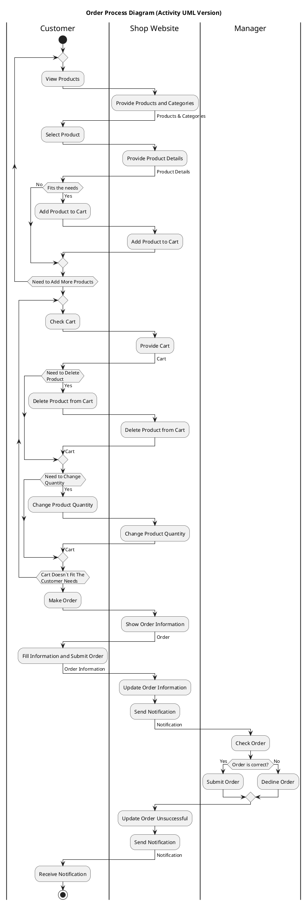

# **Creation and Confirmation of an Order**

## **BPMN Diagram**

## **Activity Diagram**

# **PlantUML Declaration**

```plantuml
@startuml
title Order Process Diagram (Activity UML Version)

|Customer|
start
repeat
  :View Products;

  |Shop Website|
  :Provide Products and Categories;
  -> Products & Categories;

  |Customer|
  :Select Product;

  |Shop Website|
  :Provide Product Details;
  -> Product Details;

  |Customer|
  if (Fits the needs) then (Yes)
    :Add Product to Cart;
    
    |Shop Website|
    :Add Product to Cart;

    |Customer|
  else (No)
  endif

repeat while (Need to Add More Products)
repeat
:Check Cart;
|Shop Website|
:Provide Cart;
  -> Cart;
|Customer|


if (Need to Delete\nProduct) then (Yes)
  :Delete Product from Cart;
  |Shop Website|
:Delete Product from Cart;
  -> Cart;
|Customer|
endif

if (Need to Change\nQuantity) then (Yes)
  :Change Product Quantity;
|Shop Website|
:Change Product Quantity;
  -> Cart;
|Customer|
endif
repeat while (Cart Doesn`t Fit The\nCustomer Needs)

:Make Order;

|Shop Website|
:Show Order Information;
  -> Order;
|Customer|

:Fill Information and Submit Order;
-> Order Information;

|Shop Website|
:Update Order Information;

:Send Notification;
-> Notification;

|Manager|
:Check Order;

if (Order is correct?) then (Yes)
  :Submit Order;
else (No)
  :Decline Order;
endif

|Shop Website|
:Update Order Unsuccessful;
:Send Notification;
-> Notification;

|Customer|
:Receive Notification;
stop

@enduml
```