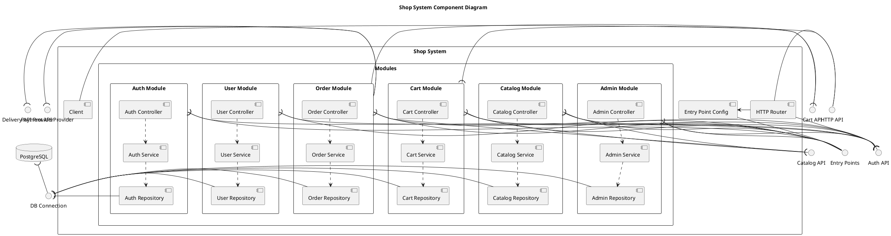

# **Component Diagram**

## **PUML Declaration**

```puml
@startuml Component_Diagram

title Shop System Component Diagram

skinparam {
  componentStyle uml2
  packageStyle rectangle
}

interface "HTTP API" as HTTP_API
interface "DB Connection" as DB_CONN
interface "Payment API Provider" as PAYMENT_API
interface "Delivery API Provider" as DELIVERY_API
interface "Auth API" as AUTH_API
interface "Entry Points" as ENTRY_POINTS
interface "Catalog API" as CATALOG_API
interface "Cart API" as CART_API

package "Shop System" {

  component "Client" as Client

  component "HTTP Router" as Router

  package "Modules" {
    
    package "Admin Module" as Admin {
      component "Admin Controller" as AC
      component "Admin Service" as AS
      component "Admin Repository" as AR

      AC ..> AS
      AS ..> AR
      
      AC -[hidden]right-> AR
    }

    package "User Module" as User {
      component "User Controller" as UC
      component "User Service" as US
      component "User Repository" as UR
      
      UC ..> US
      US ..> UR
    }

    package "Auth Module" as Auth {
      component "Auth Controller" as AuC
      component "Auth Service" as AuS
      component "Auth Repository" as AuR
      
      AuC ..> AuS
      AuS ..> AuR
    }

    package "Order Module" as Order {
      component "Order Controller" as OC
      component "Order Service" as OS
      component "Order Repository" as OR
      
      OC ..> OS
      OS ..> OR
    }

    package "Cart Module" as Cart {
      component "Cart Controller" as CC
      component "Cart Service" as CS
      component "Cart Repository" as CR
      
      CC ..> CS
      CS ..> CR
    }

    package "Catalog Module" as Catalog {
      component "Catalog Controller" as CaC
      component "Catalog Service" as CaS
      component "Catalog Repository" as CaR
      
      CaC ..> CaS
      CaS ..> CaR
    }

    
    Admin -down-( AUTH_API
    User -down-( AUTH_API
    Order -down-( AUTH_API
    Cart -down-( AUTH_API
    Catalog -down-( AUTH_API

    Auth )-right- AUTH_API

    Admin )-- ENTRY_POINTS
    User )-- ENTRY_POINTS
    Auth )-- ENTRY_POINTS
    Order )-- ENTRY_POINTS
    Cart )-- ENTRY_POINTS
    Catalog )-- ENTRY_POINTS

    Catalog )-right- CATALOG_API
    Cart -down-( CATALOG_API
    Order -down-( CATALOG_API

    Cart )-right- CART_API
    Order -left-( CART_API

  }
  
  component "Entry Point Config" as Config

  Router -right-> Config
  Config -up- ENTRY_POINTS
  
  Router -left-( AUTH_API
  
  Client - HTTP_API
  HTTP_API - Router
}

database "PostgreSQL" as DB

DB )-- DB_CONN
AR -left-( DB_CONN
UR -left-( DB_CONN
AuR -left-( DB_CONN
OR -right-( DB_CONN
CR -right-( DB_CONN
CaR -right-( DB_CONN

Order -left-( PAYMENT_API
Order -left-( DELIVERY_API

@enduml
```

## **PUML Generated Image**

